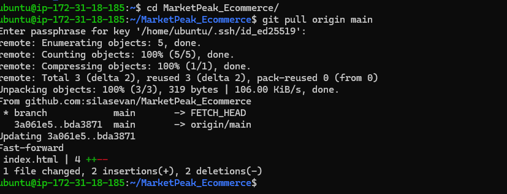

# 🚀 Deploying a Website to AWS EC2 with GitHub Integration and Continuous Deployment

This guide documents how I deployed my **MarketPeak_Ecommerce** project to an AWS EC2 instance using Git, Apache, and SSH for secure and seamless updates. It also includes setting up continuous deployment using GitHub branches and pull requests.

---

## 🛠️ Prerequisites

- AWS EC2 instance (Ubuntu)
- GitHub account with a repository
- SSH key pair for secure Git operations
- Git and Apache installed on EC2

---

## 📦 Project Setup

### 1. Create Local Project Directory

```bash
mkdir MarketPeak_Ecommerce
cd MarketPeak_Ecommerce
2. Initialize Git and Push to GitHub
git init
git add .
git commit -m "Initial commit"
git branch -M main
git remote add origin https://github.com/silasevan/MarketPeak_Ecommerce.git
git push -u origin main


🔐 Set Up EC2 Server with SSH and GitHub
3. SSH into EC2 Instance

ssh -i /path/to/my-key.pem ubuntu@<EC2-PUBLIC-IP>
4. Generate SSH Key on EC2
ssh-keygen -t ed25519 -C "ec2-git"
cat ~/.ssh/id_ed25519.pub

5. Add SSH Key to GitHub
Go to GitHub → Settings → SSH and GPG keys → New SSH Key

Paste the copied key and save

6. Clone Repository Using SSH
git clone git@github.com:silasevan/MarketPeak_Ecommerce.git
🌐 Configure Apache Web Server
7. Update and Install Apache
sudo apt update
sudo apt install apache2 -y
8. Start and Enable Apache
sudo systemctl start apache2
sudo systemctl enable apache2

9. Configure Apache Document Root
sudo rm -rf /var/www/html/*
sudo cp -r ~/MarketPeak_Ecommerce/* /var/www/html/
10. Reload Apache to Apply Changes
sudo systemctl reload apache2
🔐 Configure EC2 Security Group
Go to your EC2 Dashboard → Security Groups → Inbound Rules

Add rule:

Type: HTTP

Port: 80

Source: Anywhere (0.0.0.0/0)

 Visit Your Website
Open your browser and navigate to:

http
Copy
Edit
http://<EC2-PUBLIC-IP>
You should now see your deployed website 🎉

🔄 Continuous Deployment via GitHub Branches
11. Create and Switch to a Development Branch
git checkout -b development
12. Make Changes (e.g., edit index.html)
# Modify the index.html file
git add index.html
git commit -m "Update homepage text in development branch"
git push -u origin development
13. Open a Pull Request on GitHub
Go to your GitHub repo

Click "Compare & pull request"

Merge the development branch into main

14. Pull the Latest Changes on the EC2 Server
cd ~/MarketPeak_Ecommerce
git pull origin main
15. Reload Apache to Reflect Changes
sudo cp -r ~/MarketPeak_Ecommerce/* /var/www/html/
sudo systemctl reload apache2
Visit your site again — changes should now be live!

📸 Screenshots





📁 Project Structure

MarketPeak_Ecommerce/
├── index.html
├── css/
│   └── styles.css
└── js/
    └── script.js


👤 Author
Ivang Silas Onda
GitHub: @silasevan

🧾 License
MIT License